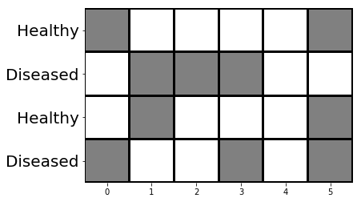
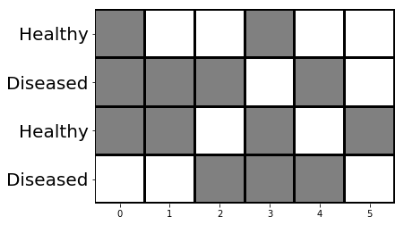
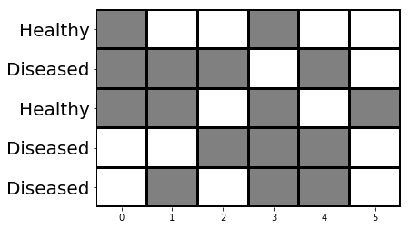

# TOC
<!-- TOC depthFrom:1 depthTo:6 withLinks:1 updateOnSave:0 orderedList:0 -->

- [TOC](#toc)  
		- [Topics today:](#topics-today)  
			- [Downloads:](#downloads)  
	- [Exercise 1: Power Calculations](#exercise-1-power-calculations)  
			- [Exercise 1.1](#exercise-11)  
			- [Exercise 1.2](#exercise-12)  
				- [1.2.1](#121)  
				- [1.2.2](#122)  
				- [1.2.3](#123)  
		- [Exercise 2: Population structure](#exercise-2-population-structure)  
				- [2.1](#21)  
				- [2.2](#22)  
				- [2.3](#23)  

<!-- /TOC -->
### Topics today:
 - Internalise the concept of statistical power:  
*how likely are we to make [type II errors](https://en.wikipedia.org/wiki/Type_I_and_type_II_errors) given our experimental design?*

 - Confounders: avoiding Type I errors arising from population structure


#### Downloads

<a id="raw-url" href="https://raw.githubusercontent.com/troe27/UU-GWAS04/master/data/gwas_pop_str_sim.RData">gwas_pop_str_sim.RData</a>

<a id="raw-url" href="https://raw.githubusercontent.com/troe27/UU-GWAS04/master/scripts/plot_QQ_function.R">plot_QQ_function.R</a>.


## Exercise 1: Power Calculations

When doing power calculations for GWAS, we can use [**NCP**, the noncentrality parameter](https://en.wikipedia.org/wiki/Noncentrality_parameter) as our measurement for statistical power. Without going much into detail, we can treat this parameter as an indicator for how likely it is that our planned analysis will be able to detect associated variants. It is Bounded between 0 and 1, corresponding to being able to detect zero and 100 % of all variants.

for our case & parameter space, we can estimate NCP like this:  


where
*n* is the number of observations  
r2 is the pairwise correlation between the causal marker and the genotyped marker.  
*MAF* is the minor allele frequency, and  
 is the effect size of an allele on the phenotype in standard deviation units.

#### Exercise 1.1
  translate the equation into an R function!

  <details><summary>tips</summary>
  <p>

  ```R
  pow.calc <- function(n, rsquare, maf, beta){
    ncp <- n*rsquare*2*maf*(1-maf)*beta*beta
    return(ncp)
  }
  ```


  </p>
  </details>


  <br>
  <br>


#### Exercise 1.2
  You're planning an exciting study on a physiologically relevant trait that for sure will be your breakthrough to fame and fortune!
  However, due to the dire funding situation you keep finding yourself in, you will have to be smart about the experimental setup.
  Based on similar studies on related traits as well as initial estimations of the heritability of your trait, you estimate that you need to be able to detect variants with a a minor allele frequency down to 0.25, that explain about 14% of the observed phenotypical variance, i.e. having an effect size of about 0.02 standard deviations.

##### 1.2.1
  So far you've budgeted for phenotyping and genotyping of about 2000 individuals. Now, to your surprise, some departmental funding has come through.
  Should you invest this windfall into a higher marker-density phenotyping that raises your average marker-rsquare from 0.8 to 0.99, or add another 500 individuals?

##### 1.2.2
  After hearing of your success in winning the departmental funding, one of the senior PI's in your department offers to match ( i.e. double) that funding ( Under the condition that *they* will be the last author, of course.). How would this additional money change your quest for (statistical) power?

##### 1.2.3
  While finishing up your experimental design, your postdocs approach you with an idea for a method that would drastically improve precision for the your phenotypes, reducing the noise in the variance and there potentially raising the variance attributable to the genotypes. This could increase your predicted effectsizes (beta) to 0.03, but would use up all your excess funding. Assuming it works, would it be worth it?

### Exercise 2: Population structure

##### 2.1
For the second exercise today, we will try to have a look at how population structure might skew your association results, how to identify it, and how one can correct for it. If the signal we are looking for is perfectly correlated with our population structure, it becomes impossible to disentangle the two. take these toy examples of 4 individuals and 6 markers: can you find the causative marker for the "diseased"-phenotype in both examples?

  
  


probably not for the latter. but what if we added another individual?



The second example would be an example where population structure and phenotype are perfectly correlated.this makes it inpossible to disentangle the two. however, we could rescue the study by increasing the diversity of our panel

##### 2.2
For real-world populations and quantitative traits however, even partial population structure can be very problematic, and lead to a lot of false positive associations. To have a closer look at this, we are going to work with a simulated dataset where we know the exact nature of the population structure.

We have stored the data in a .Rdata file, which you can get here:
<a id="raw-url" href="https://raw.githubusercontent.com/troe27/UU-GWAS04/master/data/gwas_pop_str_sim.RData">gwas_pop_str_sim.RData</a>


It contains a simple 500 x 2003 dataframe (you can check these things with ```dim()```!)
with 500 samples, 2k markers and one "ID", "phenotype" and "relatedness" column.

using this dataset, we can create a very simple linear model to do an association analysis between the genotypes and the phenotype:

```R

### phe1 is the phenotype, relatedness is used to correct population structure.
load("gwas_pop_str_sim.RData")

## trait values
y<-gwas_pop_str_sim$phe1

## how many markers
m<-20000

## Do association analysis without correcting for the population structure:

pval_ori<- rep(NA,m)# to store p values
for(l in 1:m){
  pval_ori[l] <- summary(lm(y~gwas_pop_str_sim[,(l+3)]))$coefficients[2,4]
  }
```
we can then plot this as a manhattan plot ( -log10 of the pvalues) with a corrected significance threshold of 0.05/20000 as a horizontal line.


<details><summary>tips</summary>
<p>

```R
library("ggplot2")
pval_uncorrected <- data.frame(pval_ori) # make into dataframe

# we are using a bonferroni correction, which is a very simple and stringent measure of correcting for multiple testing:
significance_threshold = 0.05/20000

ggplot(data=pval1)+
  geom_point(mapping=aes(y=-log10(pval_ori), x=1:m),color='black', alpha=0.5)+
  geom_abline(, color='red', slope = 0, intercept =-log10(significance_threshold))

```

</p>
</details>


<br>
<br>

Do you have markers above the significance threshold? how many, and how are they distributed?


One of the essential plots to do whenever checking the results of your association is a [Q-Q plot](https://en.wikipedia.org/wiki/Q%E2%80%93Q_plot), a quantile-quantile plot that plots the P-values against the expected probability distribution.


We have added a function for this <a id="raw-url" href="https://raw.githubusercontent.com/troe27/UU-GWAS04/master/scripts/plot_QQ_function.R">plot_QQ_function.R</a>.
you can either paste this into your R notebook/script or keep it as a separate file in your working directory and load the function with `` source("/path/to/plot_QQ_function.R")``

either way, you can then plot them like so:
```R
plot_qq(pval_ori,20000) # 20000 is the numbers of markers
```

As you can see, the pvalues of our association are much higher than expected, which is due to the population structure.
This can also be called genomic inflation, and a "genomic inflation factor" is sometimes calculated in order to correct this.

###### 2.3
Instead, we are going to redo the association while correcting for the population structure:

```R
pval_cor<- rep(NA,m)# to store p values
pop_str<-gwas_pop_str_sim$relatedness
for(l in 1:m){
  pval_cor[l] <- summary(lm(y~gwas_pop_str_sim[,(l+3)]+pop_str))$coefficients[2,4]
}
## plot qqplot
plot_qq(pval_cor,20000)

```
when you plot the qqplot with the new p values, you can see that they are much more in line with the expected distribution, which is a sign that we successfully controlled for the population structure!

What do you see when you plot the new pvalues on top of the old ones?
Do you see as many significant hits?


<details><summary>tips</summary>
<p>

```R
pval2 <- data.frame(pval_cor)

ggplot(data=pval1)+geom_point(mapping=aes(y=-log10(pval_ori), x=1:m),color='black', alpha=0.5)+geom_abline(, color='red', slope = 0, intercept = -log10(0.05/20000))+geom_point(data=pval2, mapping=aes(y=-log10(pval_cor), x=1:m),color='red', alpha=0.5)

```

</p>
</details>


<br>
<br>
